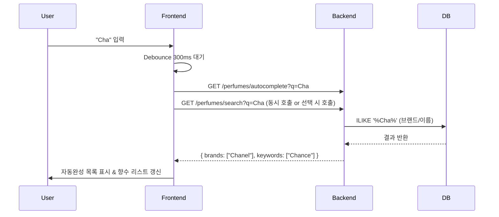

# 향수 검색 고도화: 자동완성 및 실시간 검색 구현 계획

## 1. 목표 (Goal)
사용자가 검색어를 입력하는 동안:
1.  **실시간 검색 (Live Search)**: 입력된 키워드로 즉시 향수 목록을 갱신하여 보여줍니다.
2.  **자동완성 (Autocomplete)**: 입력한 키워드와 연관된 **브랜드명**이나 **향수명**을 추천하여, 사용자가 쉽게 선택할 수 있도록 돕습니다.

## 2. Backend 구현 계획 ([backend/routers/perfumes.py](file:///Users/souluk/SKN_19/skn19-final/scentence-system/Scentence-app/backend/routers/perfumes.py))

### [NEW] `GET /perfumes/autocomplete`
-   **목적**: 검색어에 따른 추천 키워드(브랜드, 향수)를 가볍게 반환.
-   **로직**:
    1.  `TB_PERFUME_BASIC_M` 및 `TB_PERFUME_NAME_KR`에서 검색어와 일치하는 **브랜드**와 **향수명**을 조회.
    2.  **우선순위**: 브랜드명(정확도 순) -> 향수명(인기도/가나다 순).
    3.  **반환 형식**:
        ```json
        {
          "brands": ["Chanel", "Chloé"],
          "keywords": ["Chance", "Chanel No.5"]
        }
        ```
    4.  **최적화**: `LIMIT 10` 정도로 제한하여 빠른 응답 속도 보장.

## 3. Frontend 구현 계획 ([frontend/components/archives/PerfumeSearchModal.tsx](file:///Users/souluk/SKN_19/skn19-final/scentence-system/Scentence-app/frontend/components/archives/PerfumeSearchModal.tsx))

### [MODIFY] 실시간 검색 (Live Search)
-   **Debounce 적용**: 사용자가 타이핑을 멈춘 후 **300ms** 뒤에 검색 API를 호출하도록 변경. (불필요한 API 호출 방지 및 깜빡임 최소화)
-   **State**: `query` 상태가 변경될 때마다 `useEffect`를 통해 [handleSearch](file:///Users/souluk/SKN_19/skn19-final/scentence-system/Scentence-app/frontend/components/archives/PerfumeSearchModal.tsx#28-43) 자동 호출.

### [NEW] 자동완성 UI (Autocomplete UI)
-   **드로어/드롭다운**: 검색창 바로 아래에 추천 검색어 목록 표시.
-   **키보드 탐색**: 화살표 키(↑, ↓)로 추천 검색어 이동 및 엔터(Enter) 선택 기능 지원.
-   **하이라이팅**: 검색어와 일치하는 부분 굵게 표시 (예: **Cha**nel).

## 4. 데이터 흐름 (Data Flow)



## 5. 단계별 실행 가이드

1.  **Backend**: `autocomplete` Endpoint 작성 및 테스트.
2.  **Frontend**: `useDebounce` 훅 추가 (또는 커스텀 로직).
3.  **Frontend**: [PerfumeSearchModal](file:///Users/souluk/SKN_19/skn19-final/scentence-system/Scentence-app/frontend/components/archives/PerfumeSearchModal.tsx#23-117)에 자동완성 UI 레이어 추가.
4.  **Frontend**: 키보드 이벤트 핸들링 연결.

## 6. 사용자 검토 요청
이 계획대로 **자동완성 API**와 **Debounce 로직**을 추가해도 될까요?
승인하시면 Backend API부터 바로 구현하겠습니다.
